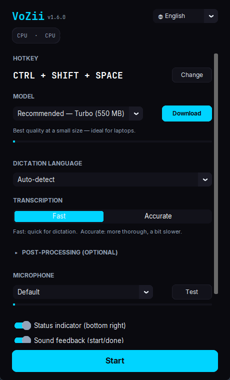
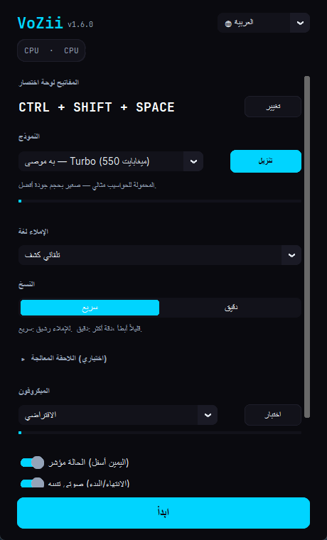
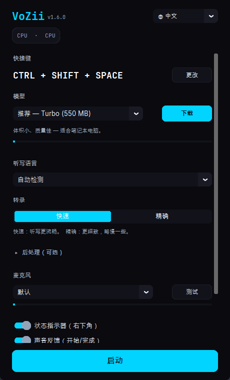

<div align="center">


<h1>VoZii</h1>

<p><b>Local AI voice-to-text for Windows.</b><br />
Hold a hotkey, speak, and your words are typed at the cursor — powered by
whisper.cpp, GPU-accelerated, and <b>100&nbsp;% offline</b>. No cloud, no API keys,
no account. One 32&nbsp;MB file.</p>

<p>
  <a href="https://github.com/haZiinstinct/VoZii/releases/latest"></a>
</p>

<p>
  <a href="https://github.com/haZiinstinct/VoZii/actions/workflows/ci.yml"></a>
  
  
  
  
  
</p>

<sub><a href="#-highlights">Highlights</a> · <a href="#-how-it-works">How it works</a> · <a href="#-get-vozii">Get it</a> · <a href="#-ai-post-processing-optional">AI post-processing</a> · <a href="#-build-from-source">Build</a></sub>

</div>

---

VoZii turns your voice into text **anywhere you can type** — a chat box, an email, an
IDE, a form field. Press and hold your hotkey, talk, let go: the transcription lands
right at the cursor. The Whisper model runs **on your own machine**, so nothing you
say ever leaves it — no upload, no subscription, no waiting on a server.

It ships as a **single 32&nbsp;MB `.exe`**. No Python to install, no runtime to set up.
The Whisper model stays loaded in RAM between dictations, so there's no per-use lag,
and an optional local LLM (via [Ollama](https://ollama.com)) can clean up filler words
and formatting — still 100&nbsp;% offline.

## ✨ Highlights

- 🎙️ **Push-to-talk, your key** — any keyboard or mouse button (default `Ctrl+Shift+Space`); press-and-hold or toggle
- 🔒 **100&nbsp;% local & private** — no cloud, no API keys, no telemetry; works with the network cable pulled
- ⚡ **No per-dictation lag** — the model stays resident in a persistent `whisper-server`, saving ~2–10&nbsp;s every time
- 🚀 **GPU-accelerated** — NVIDIA (CUDA) & AMD (Vulkan), automatic detection, CPU fallback; 5–10× faster with a GPU
- 🌍 **9-language UI + 18 dictation languages + auto-detect** — the interface follows your Windows language; dictation covers all ~99 Whisper languages
- 🎯 **Speed / Accuracy toggle** — greedy decoding for snappy dictation, beam search when you want it exact
- 🧹 **Hallucination filter** — silence and phantom phrases (*"thanks for watching"*, …) are dropped, not typed
- 📋 **Clipboard-safe** — inserts at the cursor and restores whatever was on your clipboard afterwards
- 🕘 **History** — your last dictations are re-copyable from the tray menu (local, toggleable)
- 🧠 **Optional AI cleanup** — a local Ollama model removes filler, fixes grammar, or turns speech into a polished prompt
- 🛡️ **Verified downloads** — models and binaries are checked against pinned SHA-256 hashes before they run
- 📦 **Single 32&nbsp;MB file** — no installer, no dependencies, dark UI in the haZii design language

## 🖼️ Screenshots

<div align="center">
  
  &nbsp;
  
  &nbsp;
  
</div>

> One window, many languages — the UI is fully translated (with right-to-left layout for
> Arabic) and picks your Windows language on first run. Switch any time with the 🌐 picker.

## ⌨️ How it works

1. **Hold** your hotkey (default `Ctrl+Shift+Space`).
2. **Speak** into your microphone — a small status overlay shows `● REC`.
3. **Release** the hotkey — VoZii transcribes locally (`· · ·`) …
4. … and **types the text** at your cursor. Optionally, a local LLM cleans it up first.

Right-click the tray icon for your **last transcriptions**, **settings**, the **log**, or
to **quit**. The status overlay reports everything at a glance — `CLIP` (text is on the
clipboard, no field was focused), `SHORT` / `EMPTY`, or `ERR:MIC` / `ERR:WHISPER`.

### What's inside

| | |
| --- | --- |
| 🗣️ **Whisper models** | Fast (Tiny, 75&nbsp;MB) · **Recommended** (large-v3-turbo Q5, ~550&nbsp;MB) · Best (large-v3-turbo, ~1.5&nbsp;GB) |
| 🌐 **UI languages** | Deutsch · English · Español · Français · Português · Русский · 中文 · 日本語 · العربية |
| 🎧 **Dictation** | 18 hand-picked languages + **Auto-detect** covering all ~99 Whisper languages |
| 🖥️ **Compute** | NVIDIA CUDA · AMD Vulkan · CPU fallback — auto-detected and cached |
| 🎚️ **Decoding** | **Fast** (greedy) for everyday use · **Accurate** (beam search) when it matters |
| 🔧 **Extras** | Persistent audio stream (no clipped first syllable) · microphone level test · autostart with Windows |

## 🚀 Get VoZii

1. **[Download `VoZii.exe`](https://github.com/haZiinstinct/VoZii/releases/latest)** from the latest release.
2. **Double-click** — the settings window opens; your GPU is detected automatically.
3. **Download a model** (~550&nbsp;MB the first time; the *Recommended* turbo model is a great default).
4. *(Optional)* **Test your microphone** — a live level meter confirms the signal.
5. Click **Start** — VoZii lives in your system tray, ready whenever you hold the hotkey.

> **SmartScreen warning?** That's expected for an unsigned `.exe`. Click *More info →
> Run anyway*, or right-click the file → *Properties → Unblock → Apply*.

**Requirements**

- **OS:** Windows 11 (64-bit)
- **RAM:** 2&nbsp;GB free (4&nbsp;GB recommended for larger models)
- **GPU:** optional but recommended — NVIDIA GeForce (CUDA), AMD Radeon (Vulkan), or integrated; CPU works too
- **Data:** models, config and log live under `%LOCALAPPDATA%\VoZii`

## 🧠 AI post-processing (optional)

VoZii can polish transcripts with a **local** LLM through [Ollama](https://ollama.com) —
no text ever leaves your machine. A one-click setup inside VoZii installs Ollama, starts
it, and pulls a model (with live progress and a cancel button). Pick a tier to match your
hardware:

| Tier | Model | Size |
| --- | --- | --- |
| Fast | `llama3.2:1b` | ~1.3&nbsp;GB |
| **Balanced** *(default)* | `qwen2.5:3b` | ~2&nbsp;GB |
| Best | `gemma3:4b` | ~3&nbsp;GB |

**Three modes:**

- **Off** — raw Whisper output.
- **Smart** — removes filler, fixes grammar, and understands spoken commands like
  *"as a list"*, *"as an email"*, *"heading"*, *"as code"*, *"new paragraph"*.
- **Prompt** — rewrites what you said into a clean, well-structured AI prompt.

If Ollama isn't installed or a call fails, VoZii silently falls back to the raw transcript —
you never lose a dictation.

## 🔒 Privacy

VoZii runs **entirely on your machine**:

- ✅ No audio is ever sent to a server — transcription is fully local
- ✅ No internet needed to run (only once, to download a model)
- ✅ No telemetry, no analytics, no accounts
- ✅ History (last 50) stays in a local `history.json` — toggleable and clearable in settings

## 🛠️ Build from source

Python 3.12+, quality-gated by [ruff](https://github.com/astral-sh/ruff) and a `pytest`
suite on GitHub Actions; releases are built and published automatically on `v*` tags.

```bash
python -m venv .venv && .venv\Scripts\activate
pip install -r requirements.txt
python -m src.main            # run VoZii
pytest -q                     # run the test suite
python scripts/build.py       # build the single-file VoZii.exe (PyInstaller)
```

The tree is a clean set of single-purpose modules — `hotkey.py`, `transcriber.py`,
`text_processor.py` (Ollama), `filters.py` (hallucinations), `i18n.py`, `overlay.py`,
`downloader.py` (SHA-256 pins) and friends under [`src/`](src).

## ☁️ Why local instead of the cloud?

| | VoZii (local) | Typical cloud dictation |
| --- | --- | --- |
| Your voice | never leaves the PC | uploaded to a server |
| Cost | free, no subscription | monthly fee / per-minute |
| API key / account | none | usually required |
| Offline | ✅ works fully offline | ❌ needs a connection |
| Latency | local, model stays in RAM | network round-trip |

## 📄 License

Proprietary — see [LICENSE](LICENSE). Third-party components are listed in
[THIRDPARTY-LICENSES.md](THIRDPARTY-LICENSES.md). VoZii uses
[whisper.cpp](https://github.com/ggerganov/whisper.cpp) by Georgi Gerganov for local
transcription.

## 💬 Contact & support

- **Bugs / feature requests:** [GitHub Issues](https://github.com/haZiinstinct/VoZii/issues)
- **Web:** [hazii.org](https://hazii.org) · **Email:** kontakt@hazii.org

<div align="center"><sub>Built by <a href="https://hazii.org">haZii</a> · <code>// code: haZii.org</code></sub></div>
